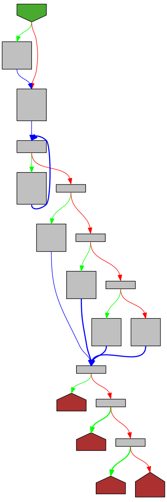
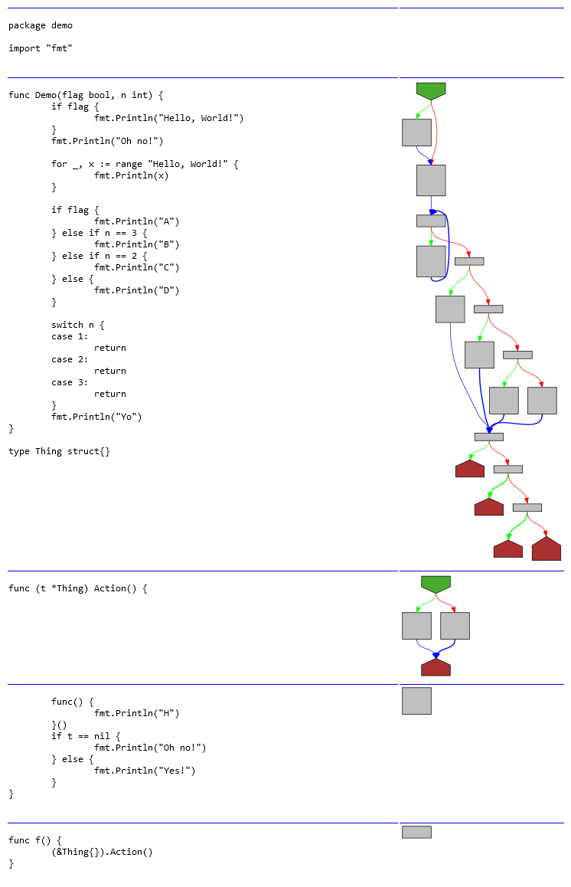

# go-overview-graph

A tool for displaying graph overviews of Go functions.

This is very early work-in-progress!!!

## Example

```go
// File: demo/demo.go
func Demo(flag bool, n int) {
	if flag {
		fmt.Println("Hello, World!")
	}
	fmt.Println("Oh no!")

	for _, x := range "Hello, World!" {
		fmt.Println(x)
	}

	if flag {
		fmt.Println("A")
	} else if n == 3 {
		fmt.Println("B")
	} else if n == 2 {
		fmt.Println("C")
	} else {
		fmt.Println("D")
	}

	switch n {
	case 1:
		return
	case 2:
		return
	case 3:
		return
	}
	fmt.Println("Yo")
}
```

Run the tool:

```bash
go run . function --pkg ./demo --function Demo | dot -Tpng -o"media/demo.png"
```

And we get:



## Side By Side 

Run:

```bash
mkdir sxs
go run . sxs --pkg ./demo --out ./sxs
```

And we get:

